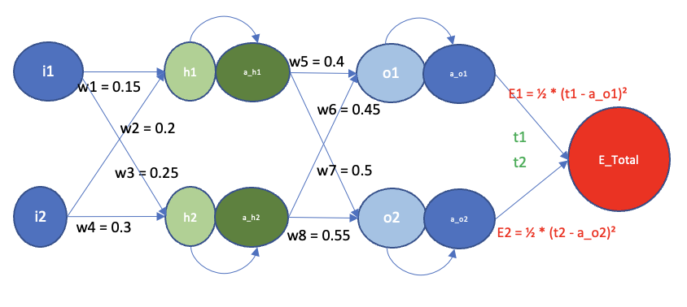
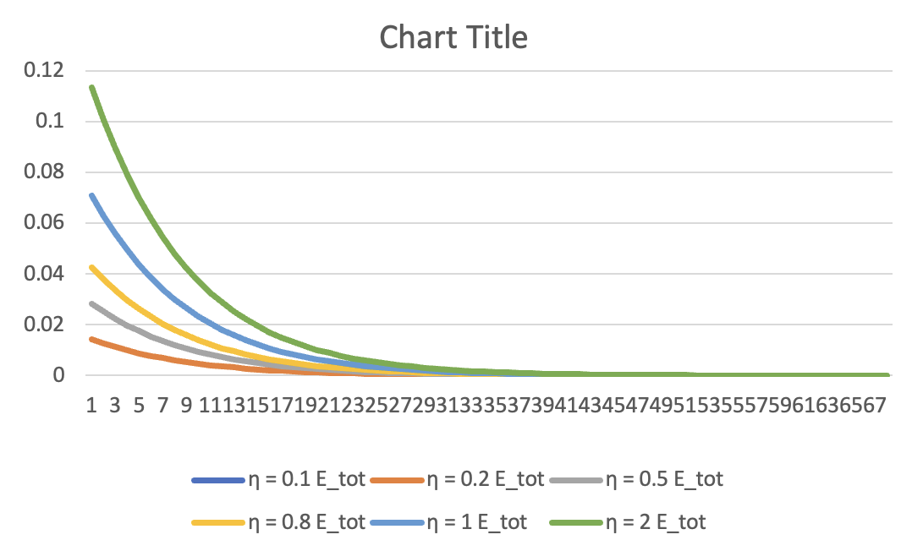
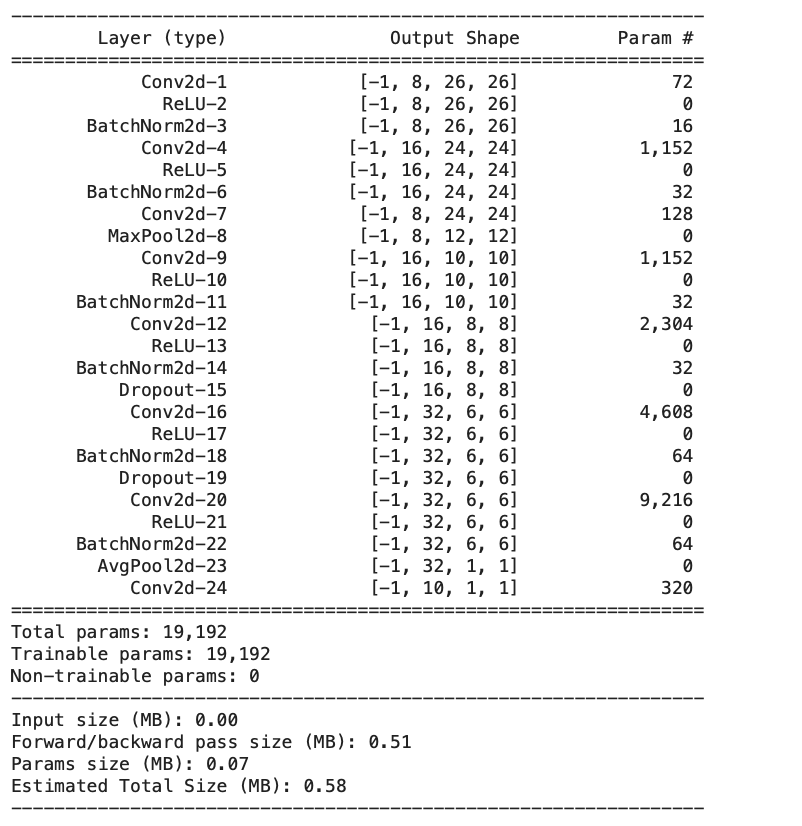
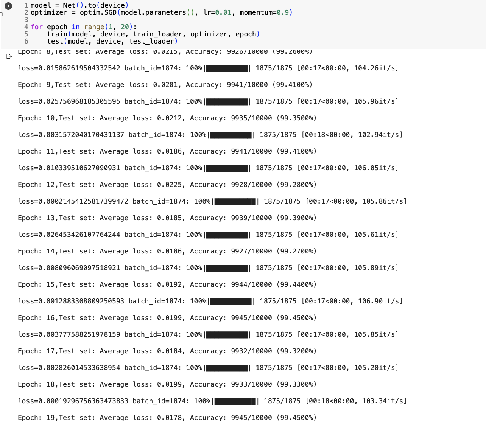

# PART 1

## Backpropagation

## Variation of error with learning rate

#PART 2

# Convolutional Neural Network for MNIST Classification

This repository contains the code for training a convolutional neural network (CNN) in PyTorch to achieve above 99.4% validation accuracy on the MNIST dataset. The goal was to design a network with less than 20k parameters and trained within 20 epochs. Various techniques and architectural choices were explored to achieve this high accuracy under the given constraints.

## Constraints

The following constraints were considered during the development of the network:

1. **Parameter Limit**: The network was designed to have less than 20,000 parameters to ensure model efficiency and prevent overfitting.

2. **Epoch Limit**: The training process was limited to a maximum of 20 epochs to balance training time and model performance.

## Approach

The following techniques and architectural elements were considered and incorporated into the final network design to meet the above constraints:

- **Different Layers**: Different types of convolutional layers were used, including 3x3 convolutions, 1x1 convolutions, and MaxPooling.

- **Batch Normalization**: Batch normalization was employed after each convolutional layer to improve the stability and speed up the training process.

- **Image Normalization**: The input images were normalized to have zero mean and unit variance, enhancing the training convergence.

- **Dropout**: Dropout regularization with a dropout rate of 0.04 was applied to the network to prevent overfitting.

- **Transition Layers**: Transition layers were introduced to downsample the feature maps before feeding them into subsequent layers, reducing the number of parameters.

- **Activation Function**: The ReLU activation function was used throughout the network to introduce non-linearity and improve model performance.

- **Global Average Pooling**: A global average pooling layer was added to reduce the spatial dimensions of the feature maps before the final classification layer.

- **Softmax**: The final layer of the network utilized a softmax activation function to produce class probabilities.

## Network Architecture

The final network architecture has total 19192 parameters in total.

## Performance on test

The model is able to achieve a final accuracy of 99.45% > 99.4%  on test set as can be seen in the output in jupyter notebook.

## Usage

To see a demo of the train process:
DO a run all of the RR_session6.ipynb in Jupyter notebook environment.
